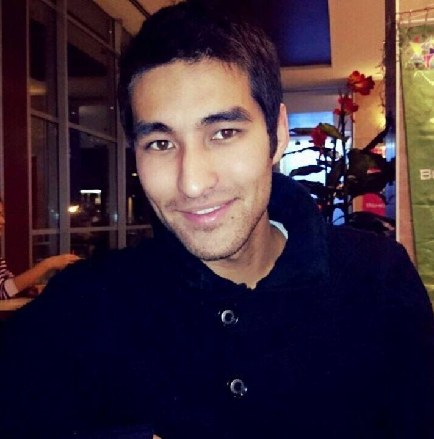

<!DOCTYPE html>
<html lang="en">
  <head>
    <meta charset="utf-8" />
    <meta http-equiv="X-UA-Compatible" content="IE=edge" />
    <meta name="viewport" content="width=device-width, initial-scale=1" />
    <title>Resume</title>
    <!-- Bootstrap -->
    <link href="css/bootstrap.min.css" rel="stylesheet" />
    <link href="ionicons/css/ionicons.min.css" rel="stylesheet" />
    <link href="css/animate.min.css" rel="stylesheet" />
    <link href="css/aos.css" rel="stylesheet" />
    <link href="css/style.css" rel="stylesheet" />
  </head>

  <body>
    <!-- header -->
    <header class="navbar-fixed-top">
      <nav>
        <ul>
          <li><a href="#about">Обо мне</a></li>
          <li><a href="#projects">Портфолио</a></li>
          <li><a href="#contact">Контакты</a></li>
        </ul>
      </nav>
    </header>
    <!-- ./header -->

    <!-- home -->
    

      

        

          

            <h3 class="image11">
              
            </h3>
            <h4>Токоев Азамат</h4>
            <h1>
              FullStack 
              Разработчик
            </h1>
          

        

      

    

    

    

        

            

                <h4>02</h4>
                <h1 class="size-50">Моя Биография</h1>
                

            

            

                <ul class="timeline">
                    <li class="timeline-event" data-aos="fade-up">
                        <label class="timeline-event-icon"></label>
                        

                            
Декабрь 1991 - наст.время

                            
<strong>Родился 16 декабря 1991 года в городе Бишке</strong>
                                 Окончил школу-гимназию №20 в 2009 году
                              Высшее образование получил в Кыргызском Государственном университете им. Жусупа Баласагына в 2015 году  
                        Активно занимаюсь благотворительной деятельностью , спортом и читаю художественную литературу

                        

    <!-- Контакты -->
    

      

        

          <h4>03</h4>
          <h1 class="size-50">Связаться со мной</h1>
          

        

        

          <h3>Мобильный телефон</h3>
          
+996771546191

          <h3>Email</h3>
          
9supernine@gmail.com

          
            <!-- !Социальные сети -->
          <h3>Социальные сети</h3>

          <ul class="social">
            <li>
              <a href="#"><i class="ion-social-facebook"></i></a>
            </li>
            <li>
              <a href="#"><i class="ion-social-twitter"></i></a>
            </li>
            <li>
              <a href="#"><i class="ion-social-instagram"></i></a>
            </li>
            <li>
              <a href="#"><i class="ion-social-dribbble"></i></a>
            </li>
          </ul>
          

          

        

        

          <form
            class="contact-bg"
            id="contact-form"
            name="contact"
            method="post"
            novalidate="novalidate"
          >
            <input
              type="text"
              name="name"
              class="form-control"
              placeholder="Ваше имя"
            />
            <input
              type="email"
              name="email"
              class="form-control"
              placeholder="Ваша почта"
            />
            <input
              type="text"
              name="phone"
              class="form-control"
              placeholder="Телефонный номер"
            />
            <textarea
              name="message"
              class="form-control"
              placeholder="Ваше сообщение"
              style="height: 120px"
            ></textarea>
            <button
              id="submit"
              type="submit"
              name="submit"
              class="btn btn-glance"
            >
              Отправить
            </button>
          </form>
        

      

    

    <!-- ./contact -->

    <!--DEMO01-->

    <!-- jQuery -->
    
    <!--  plugins  -->
    
    
    
    
    

    <!--  main script  -->
    
  </body>
</html>
